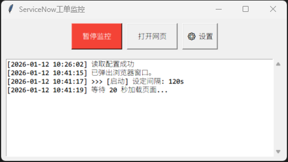

# ServiceNow & Incident Auto-Monitor Tool

English | [简体中文](README_ZH.md)



A desktop automation tool built with Python for IT Support and Service Desk teams. It automates browser refreshing, scans for new "Open" or "New" tickets using image recognition, and alerts you with sound.

---

###  Key Features

* **Dual-Window Monitoring**: Simultaneously monitors two different browser tabs (e.g., Incidents and Catalog Tasks).
* **Intelligent Image Recognition**: Uses OpenCV-powered scanning to detect "Open" or "New" labels on your screen with adjustable confidence levels.
* **Audio Alerts**: Plays a custom `.wav` file or a system beep when a new ticket is detected.
* **Real-time Visual Logs**: A GUI-based log area with precise timestamps for every scan and action.
* **Persistent Settings**: Built-in Settings menu to update URLs and scan intervals without touching the code. Settings are saved locally in `config.ini`.
* **Silent Background Mode**: Can be run as a `.pyw` file to hide the console/CMD window for a cleaner workspace.

---

### 📂 File Structure

Ensure the following files are located in the same directory:

| File Name | Description |
| --- | --- |
| `main.py` (or `.pyw`) | The main application script. |
| `config.ini` | Configuration file (auto-generated on first run). |
| `alert.wav` | Your custom alert sound file. |
| `open_label.png` | Screenshot of the "Open" status label. |
| `new_label.png` | Screenshot of the "New" status label. |
| `requirements.txt` | List of required Python libraries. |

---

### 🛠 Installation & Setup

#### 1. Environment Setup

Ensure you have Python 3.x installed. Run the following command in your terminal to install dependencies:

```bash
pip install pyautogui pygetwindow pygame opencv-python pillow

```

#### 2. Prepare Assets

* **Screenshots**: Use a snipping tool to capture the "Open" and "New" labels from your ticket system. Save them as `open_label.png` and `new_label.png` in the script folder.
* **Audio**: Place a short audio file named `alert.wav` in the same folder.

#### 3. Configuration

Launch the application and click the **⚙ Settings** button:

* **URL 1 / 2**: Enter the full web addresses for your ticket queues.
* **Interval (sec)**: Set the refresh cycle (recommended: `120` or higher to allow pages to load).

---

### 🚀 How to Use

1. **Open Browser**: Open your ticket system in Chrome or Edge. Ensure the window title contains the keywords defined in the script (e.g., "Incidents").
2. **Start Monitoring**: Run the script and click **"Start Monitoring"**.
3. **Automation Flow**:
* The app activates the browser window and presses `F5` to refresh.
* It waits 20 seconds for the page to load.
* It scans the screen for the target images.
* If a match is found, an alert sounds and a log entry is created.


4. **Quick Links**: Use the **"Open URL"** button to quickly launch your ticket pages.

---

### ⚠️ Important Notes

* **Window Titles**: The script identifies your browser by its window title. If your system's title changes, update the `WINDOW_TITLE` variables in the code.
* **Display Scaling**: Keep your Windows Display Settings at 100% or ensure you take screenshots at the same scaling level you intend to use.
* **Percent Sign (%) Error**: This version is patched with `interpolation=None` to prevent crashes caused by complex URLs containing `%` characters.

---

**Would you like instructions on how to package this script into a standalone `.exe` file for easier sharing?**
